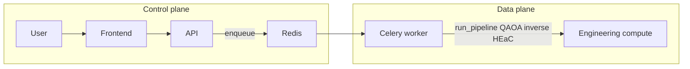

# Architecture: Control Plane vs Data Plane

This document describes the **current state** (single heavy API image) and a **proposal** to split the **control plane** (UI + orchestrator) from the **data plane** (heavy engineering compute workers). The goal is a slimmer, faster API deploy and independent scaling of workers.

See [architecture_overview.md](architecture_overview.md) for the protocol-to-applications flow and [ARCHITECTURE_MODULARIZATION_PROPOSAL.md](ARCHITECTURE_MODULARIZATION_PROPOSAL.md) for the full service split.

---

## Current state

- **Single API image** built with `.[app,engineering]` ([pyproject.toml](../../pyproject.toml) optional-dependencies). The API container and the Celery worker container both use the same image ([Dockerfile.api](../../Dockerfile.api), [docker-compose.yml](../../docker-compose.yml)).
- **Heavy dependencies** in that image: Qiskit, PyTorch, Celery, Redis client, engineering scripts (routing, inverse design, HEaC, MEEP, etc.). The API process rarely needs Qiskit or PyTorch at request time; it mainly enqueues tasks and serves the React app and REST/WebSocket.
- **Hybrid Compute Dispatcher** ([src/backend/dispatcher.py](../../src/backend/dispatcher.py)) routes DAG nodes to local, IBM QPU, or EKS. The actual heavy work runs in Celery tasks (e.g. `run_pipeline_with_circuit_task`), which today share the same Python env as the API.

---

## Proposal: control plane vs data plane

| Plane | Responsibility | Dependencies | Deploy |
|-------|-----------------|--------------|--------|
| **Control plane** | FastAPI (REST, WebSocket), React frontend, task enqueue (Celery `.delay`), job status, auth, config. No execution of routing/inverse/HEaC. | FastAPI, uvicorn, Celery client (Redis), React build. No Qiskit, no PyTorch, no engineering scripts in the API process. | Lightweight API + frontend containers; fast startup, small image. |
| **Data plane** | Celery workers that run engineering tasks: qasm_to_asic, routing, inverse design, run_pipeline.py, HEaC, MEEP, etc. | Full `.[engineering]` (Qiskit, PyTorch, scipy, etc.) plus Celery worker, Redis client. | Dedicated worker image(s); scale workers independently; optional separate queue for heavy vs light tasks. |

**Benefits:**

- **Faster, slimmer API deploy:** Control plane image is smaller and starts faster; fewer dependency conflicts and security surface.
- **Workers scale and fail independently:** Worker OOM or long runs do not tie up the API; scale workers by queue depth or cost.
- **Clearer security boundary:** API does not load Qiskit/PyTorch or user circuit data into the same process that serves HTTP; workers can be in a separate network or cluster.

---

## Diagram

Today both API and Worker share the same image. The proposal is: API image = control only; Worker image = data plane (full engineering stack).

---

## Status (implemented)

The control-vs-data-plane split is in place:

- **Slim API image:** [Dockerfile.api](../../Dockerfile.api) installs only `.[app]` (no Qiskit, PyTorch, or engineering). The API process uses `_engineering_available()` to branch: when engineering is not installed, sync pipeline and protocol runs are routed through Celery (enqueue + wait). QASM validation is skipped in the API when the loader is unavailable (worker validates when the task runs); `/api/validate_qasm` returns 503 in slim mode with a clear message.
- **Worker image:** [Dockerfile.worker](../../Dockerfile.worker) installs `.[app,engineering]` and is used by the `celery-worker` service in [docker-compose.yml](../../docker-compose.yml). All heavy execution (pipeline, protocol submit/sim, routing, inverse) runs in workers.
- **Protocol:** Hardware and sim protocol runs are implemented via [run_protocol_task](../../src/backend/tasks.py) in the worker; when the API is slim it enqueues the task and waits for the result, then returns the same response shape. Job store is populated with `ibm_job_id` for WebSocket polling (polling still requires the engineering stack; in slim API the WebSocket returns a clear 503-style error).
- **Other endpoints:** Routing, inverse, QKD, quantum illumination, quantum radar return 503 with a clear message when the engineering stack is not available (control-plane-only mode).

Validate with `docker compose up --build`: API and frontend start from the slim image; workers start from the worker image; sync pipeline and protocol runs succeed via Celery.

---

## Next steps (optional)

1. ~~Implement a **slim API image**~~ Done (see Status above).
2. ~~Keep **worker image**~~ Done ([Dockerfile.worker](../../Dockerfile.worker)).
3. Validate: API health, enqueue, and task status with the slim API; workers pull and run tasks as today.
4. Document any further API changes in the migration section of [ARCHITECTURE_MODULARIZATION_PROPOSAL.md](ARCHITECTURE_MODULARIZATION_PROPOSAL.md).
