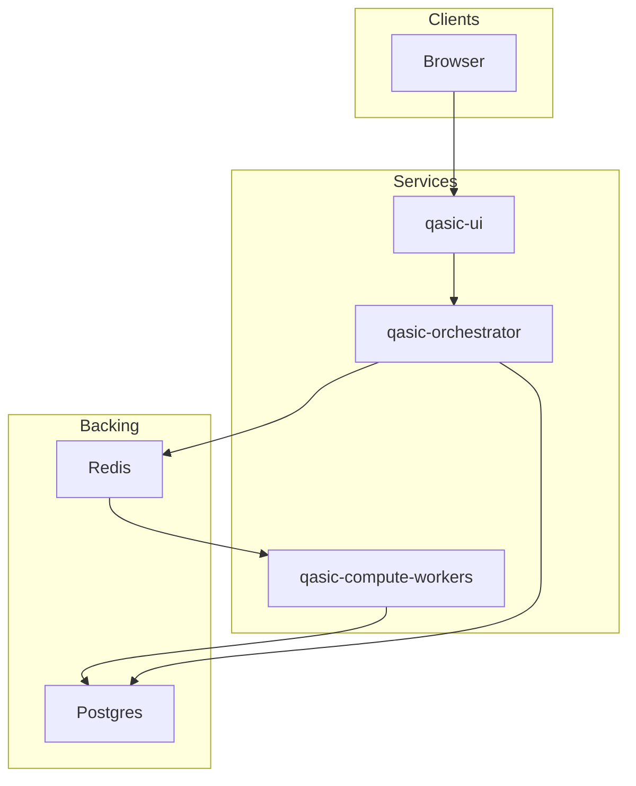

# Architecture: Modularization Proposal

This document proposes splitting the current monorepo deployment into **distinct services** (e.g. qasic-ui, qasic-orchestrator, qasic-compute-workers) so software and hardware teams can operate and deploy independently. It builds on [ARCHITECTURE_CONTROL_VS_DATA_PLANE.md](ARCHITECTURE_CONTROL_VS_DATA_PLANE.md).

---

## Target services

| Service | Current mapping | Responsibility | API / contract |
|---------|-----------------|----------------|----------------|
| **qasic-ui** | `frontend` in [docker-compose.yml](../../docker-compose.yml) | React SPA: Run Pipeline, Workflows, Deploy, Projects. Static assets. | Served over HTTP; talks to orchestrator API. |
| **qasic-orchestrator** | `api` in docker-compose | FastAPI: REST, WebSocket, auth, project/circuit validation, **task enqueue** (Celery). No heavy compute. | REST: `/api/run/pipeline`, `/api/run/pipeline/async`, `/api/tasks/{id}`, etc. Redis for Celery broker. |
| **qasic-compute-workers** | `celery-worker` in docker-compose | Celery workers: run_pipeline_with_circuit, circuit_to_asic, routing, inverse, HEaC. Full engineering stack. | Consume tasks from Redis; write results to DB or artifact store; task schema is the contract. |

Optional fourth service: **qasic-iac-orchestrator** (IaC DAG / OpenTofu) — today in [platform/iac-orchestrator](../../platform/iac-orchestrator/); can remain separate and out of scope for the first split.

---

## Deploy boundaries

- **qasic-ui:** Build (Vite); deploy as static files or container. Only needs the orchestrator base URL (env).
- **qasic-orchestrator:** Needs Redis (broker), Postgres (if used), and optionally storage/MLflow. Does not need Qiskit/PyTorch or engineering code paths in process.
- **qasic-compute-workers:** Needs Redis (broker + result backend), access to repo or mounted code/scripts, env (e.g. IBM_QUANTUM_TOKEN), and writable output dirs. Same task schema as today (Celery task names and kwargs).

**API contracts:** Existing REST and WebSocket endpoints remain; only the deployment (which process serves them) changes. Redis task payloads (task name, args, kwargs) stay as today so current workers remain compatible.

---

## Migration path

1. **Monorepo first (current):** All three services stay in one repo; docker-compose (or Helm) defines the three (or two: API+frontend, workers) services. No repo split yet.
2. **Slim orchestrator image (done):** API image ([Dockerfile.api](../../Dockerfile.api)) builds with `.[app]` only; worker image ([Dockerfile.worker](../../Dockerfile.worker)) builds with `.[app,engineering]`. [docker-compose.yml](../../docker-compose.yml) uses Dockerfile.api for `api` and Dockerfile.worker for `celery-worker`. Sync pipeline and protocol execution are routed through Celery when the API runs without the engineering stack. Validated in local docker compose; CI/staging as needed.
3. **Optional repo or submodule split later:** If needed, extract qasic-ui and/or qasic-compute-workers into separate repos or submodules. Risks: versioning (orchestrator vs worker contract), shared libs (e.g. `src/core_compute`), and CI across repos. Recommend only after control-vs-data-plane split is stable.

---

## Diagram

---

## Risks and mitigations

| Risk | Mitigation |
|------|------------|
| **Version skew** (orchestrator enqueues task v2, workers expect v1) | Keep task names and kwargs stable; add optional version in task metadata if needed; test contract in CI. |
| **Shared libs** (e.g. `src/core_compute` used by both API and workers) | Keep shared code in monorepo; API image may still install a minimal set for validation-only imports if required, or workers only hold the full tree. |
| **Operational complexity** | Document deploy order (Redis, Postgres, orchestrator, workers, UI) and health checks; use same Helm chart or compose file so one command brings up the stack. |
