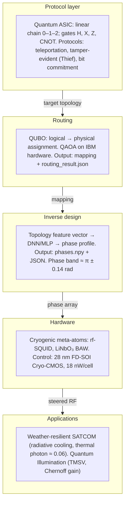

# Architecture Overview: Protocol to Applications

One-page schematic of the full stack from protocol layer to hardware and applications. See the main [whitepaper](WHITEPAPER_Holographic_Metasurfaces_Quantum_SATCOM.md) for narrative and §10 for supporting code.

**Data flow (left to right):** The protocol layer defines the minimal topology and gate set (e.g., 3-qubit linear chain for teleportation). The routing stage (QUBO + QAOA) assigns logical qubits to physical nodes and writes a mapping to JSON. The inverse-design stage consumes that topology and produces a continuous phase profile for the meta-atoms. The hardware layer (rf-SQUIDs, BAW resonators, Cryo-CMOS) applies those phases to steer microwave photons. The same stack scales to macroscopic applications: SATCOM with radiative cooling and quantum illumination.

## Orchestration and deployment

| Concept | What it is | Where |
|--------|-------------|--------|
| **EaC pipeline (Engineering pipeline)** | Fixed metasurface DAG: routing → inverse → HEaC → GDS → DRC/LVS (Prefect or sequential). | [orchestration/](../orchestration/), `engineering/run_pipeline.py --use-orchestrator` |
| **Workflows** | User-defined DAGs: protocols, routing, inverse design; per-node backend (Local, IBM QPU, EKS). | Web app Workflows page, [orchestration/executor.py](../orchestration/executor.py) |
| **Deploy** | Where the app runs: Local, VM, or cloud (AWS, GCP, Azure, OpenNebula). Target-centric UI and “Generate commands” for Tofu/Helm. | Web app Deploy page, [deploy/](../deploy/), [infra/tofu/](../infra/tofu/) |
| **IaC Orchestrator** | Advanced infra DAG: Tofu init → plan → approval → apply, custom scripts. For full control over provisioning. | [tools/iac-orchestrator/](../tools/iac-orchestrator/) |
