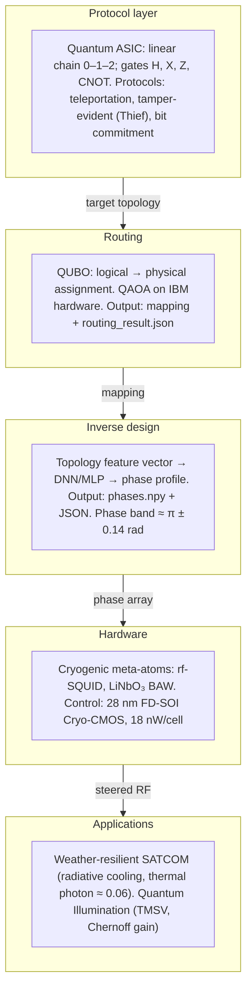

# Holographic Metasurfaces as a Scalable Control Layer for Solid-State Quantum Entanglement and Secure SATCOM

**Expanded Whitepaper**

---

## Abstract

The current trajectory of quantum computing is constrained by the physical and thermodynamic limits of fixed-wire topologies and extensive coaxial interconnects. Simultaneously, macroscopic satellite communications have been revolutionized by Metamaterial Surface Antenna Technology (MSAT). MSAT utilizes programmable active matrix holography to efficiently steer RF waves without moving parts. This whitepaper proposes a convergence of these two domains: adapting macroscopic software-defined apertures into a solid-state, cryogenic interface for subatomic wave manipulation. By utilizing a programmable metasurface to mediate entanglement between localized RF electrons, we outline an architecture that aims to eliminate the "wiring crisis" in quantum processors. This approach provides a pathway to dynamic, all-to-all qubit connectivity. Furthermore, it scales outward to enable weather-resilient, highly directional, and tamper-evident quantum SATCOM links and phased-array quantum radar.

**Related documents.** For deeper material on rf-SQUID breathers, reflective-type phase-shifter topologies, lithium niobate BAW at millikelvin, 28 nm FD-SOI Cryo-CMOS (Gooseberry), and example regional ecosystems and potential partner types cited in the long-form report (e.g., facilities such as UCSD SMM, vendors such as Quantum Design, companies such as Monarch Quantum), see *Cryogenic Metamaterial Architectures for Solid-State Quantum Routing and SATCOM* ([LaTeX source](Cryogenic_Metamaterial_Architectures_Quantum_SATCOM.tex); compile with `xelatex`). Those references are for research/vision context only; **the QASIC Engineering-as-Code project has no affiliation, partnership, or endorsement with any such entities.** For a concise paper with a math appendix (QAOA mixing Hamiltonian, DNN phase synthesis), see [WHITEPAPER_Holographic_Metasurfaces_Quantum_SATCOM.tex](WHITEPAPER_Holographic_Metasurfaces_Quantum_SATCOM.tex).

---

## 1. Introduction: The Wiring Bottleneck in Quantum Scaling

Scaling quantum architectures from noisy intermediate-scale quantum (NISQ) devices to fault-tolerant processors requires an exponential increase in qubit connectivity. Current superconducting and spin-qubit topologies rely heavily on static, etched planar couplings. They also depend on a massive influx of physical coaxial cables to deliver specific microwave control pulses.

- **The Heat Load Crisis:** The physical cables required to deliver control pulses create an insurmountable heat load at the millikelvin (mK) stage inside dilution refrigerators.
- **Topological Limits:** Each physical edge between qubits necessitates precise engineering to minimize cross-talk, restricting processors to static topologies.

Consequently, fixed topologies restrict the efficiency of multi-qubit gates, necessitating complex engineering workarounds that limit the physical expansion of the solid-state quantum chip.

---

## 2. Holographic Metasurfaces and the Quantum Bus

Rather than hard-wiring every qubit, programmable holographic metamaterials can function as a **dynamic routing layer**. The technology defines a spatially varying surface impedance across a continuous aperture using sub-wavelength meta-atoms.

In a quantum architecture, the metasurface can manipulate the **local density of photonic states** at the sub-wavelength scale. By dynamically updating the complex surface impedance via an active matrix backplane, the array can direct single microwave photons—acting as a **quantum bus**—to simultaneously couple with distant, localized electron spins trapped in artificial atoms (quantum dots). This mechanism provides a theoretical **all-to-all connectivity topology** that circumvents the need for static, etched coplanar waveguides.

**Implication for protocol-level design:** A reconfigurable bus does not require a universal gate set on a fixed graph. Instead, the same physical hardware can implement different **logical topologies** by software: a linear chain for teleportation and Bell-pair distribution, or a star topology for multi-node entanglement, without changing the underlying wiring. This aligns with a "Quantum ASIC" philosophy: define the **minimal gate set and connectivity** required for a target set of protocols (e.g., entanglement distribution, teleportation, tamper-evident links), and let the metasurface realize that connectivity dynamically rather than via static edges.

### 2.1 Architecture overview

The following diagram maps the full stack from protocol layer to hardware and applications. See [Architecture overview](architecture_overview.md) for the same figure with a short data-flow description.



---

## 3. Thermodynamic Realities and Hardware Adaptation

Transitioning macroscopic RF beamforming to the discrete quantum regime requires overcoming severe thermodynamic barriers.

- **The Thermal Noise Floor:** The energy of a microwave photon is dictated by the Planck relation \(E = h\nu\). At radio and microwave frequencies, this energy is drastically smaller than ambient thermal energy (\(h\nu \ll kT\)) at standard room temperature.
- **Decoherence:** Any attempt to entangle electrons using RF fields at room temperature is catastrophically destroyed by thermal fluctuations and phonon scattering, erasing quantum correlations within microseconds.
- **Material Phase Transitions:** Operating the system below 100 mK preserves spin coherence. However, the nematic liquid crystals traditionally used in commercial MSAT freeze into rigid crystalline states at these temperatures, losing all electro-optic tunability.

To operate successfully at 10 mK, the metasurface must replace macroscopic liquid crystals with **cryogenic solid-state components**. Utilizing ultra-low temperature varactors, arrays of superconducting quantum interference devices (SQUIDs), or precise piezoelectric quartz bulk acoustic wave (BAW) resonators allows the active matrix to dynamically steer single microwave photons without introducing thermal decoherence.

### 3.1 Key relations

The following relations and target values appear throughout the architecture and in the supporting long-form report (*Cryogenic Metamaterial Architectures for Solid-State Quantum Routing and SATCOM*).

| Quantity | Relation or value | Context |
|----------|-------------------|--------|
| Microwave photon energy | \(E = h\nu\) | Planck; at 4–12 GHz, \(h\nu \ll k_B T\) at 300 K |
| Thermal occlusion | Operate well below 100 mK | Preserve spin coherence; \(k_B T\) must not mask signal |
| Rayleigh scattering (atmosphere) | \(\gamma_c(f,T) = K_l(f,T)\,M\) | Microwave vs Mie (optical); weather resilience |
| Thermal photon occupation (channel) | \(\approx 0.06\) | After radiative overcoupling to 10 mK cold load |
| State transfer fidelity | 58.5% at 4 K | Continuous-variable teleportation with thermal suppression |
| Metasurface phase profile (inverse design) | \(\phi \in [3.03,\,3.28]\) rad; mean \(\approx 3.14\;\mathrm{rad}\) | Sub-radian perturbations around \(\pi\); low actuation energy |
| Cryo-CMOS dissipation | 18 nW per cell | Gooseberry-style CLFG; 1000 cells ⇒ 18 µW total |

---

## 4. Macroscopic Scaling: Weather-Resilient SATCOM and Radar

Beyond the internal wiring of quantum processors, metasurface-mediated entanglement unlocks massive potential for global communications. Current quantum key distribution (QKD) relies primarily on **optical photons**, which suffer from severe atmospheric attenuation, daylight scattering, and strict line-of-sight constraints.

Conversely, **entangled microwave photons**—generated via Cooper pair splitting in superconducting devices—can penetrate cloud cover and adverse weather. Integrating a programmable, flat-panel active-matrix metasurface allows these robust RF quantum states to be captured, steered, and transmitted over long distances. This unlocks the physical realization of solid-state **phased-array quantum radar**, capable of defeating classical stealth with high signal-to-noise ratios, and expands global quantum networks into heavily obscured atmospheric conditions.

---

## 5. Protocol Layer: Minimal Topology and the Quantum ASIC

The metasurface-mediated quantum bus does not merely provide all-to-all connectivity in the abstract; it can be **programmed to implement the minimal topology and gate set** required for specific quantum protocols. This "Quantum ASIC" view reduces the control problem to a well-defined set of operations. The **EaC pipeline** accepts any OpenQASM and any qubit count and derives topology from the circuit; the "minimal" spec in this section is a reference for certain protocols (e.g. teleportation).

**Minimal resource specification (illustrative):**

- **Qubits:** A small number of logical nodes (e.g., 3 for teleportation: message, Alice, Bob).
- **Topology:** For teleportation and Bell-pair–based commitment, a **linear chain** (node 0 – node 1 – node 2) suffices. Only adjacent pairs need a direct two-qubit (e.g., CNOT-equivalent) interaction.
- **Gates:** Hadamard (H), bit flip (X), phase flip (Z), and controlled-NOT (CNOT) on adjacent pairs. Optional parametrized single-qubit rotations (e.g., \(R_x(\theta)\)) for modelling disturbances or calibration.

Under this specification, **entanglement distribution** (Bell pair creation), **quantum teleportation**, and **tamper-evident link** demonstrations compile to the same fixed topology and gate set. The metasurface’s role is to *realize* this topology dynamically: at one time slice it couples qubits 0–1, at another 1–2, without adding physical wires. Scaling to more nodes or different protocols (e.g., multi-hop repeater chains) corresponds to extending the logical topology and gate list in software, while the hardware remains a reconfigurable aperture.

This approach also clarifies the **interface between chip and link**: the same minimal gate set and topology that define a "quantum modem" for SATCOM (entanglement in, classical message out, teleportation) can be implemented on the metasurface-steered quantum bus, enabling a unified design language from on-chip entanglement to over-the-air secure links.

---

## 6. Tamper-Evident Links and Secure SATCOM

Quantum channels are **intrinsically tamper-evident** in ways classical channels are not. Three principles underpin this:

- **No-cloning:** An unknown quantum state cannot be copied. Any attempt to intercept and resend degrades or alters the state.
- **Monogamy of entanglement:** Shared entanglement cannot be freely redistributed; an adversary who couples to the link reduces the correlation between the legitimate parties.
- **Measurement disturbance:** Probing the channel generally disturbs the state and leaves a statistical fingerprint that the receiver can detect (e.g., a drop in fidelity).

In a **teleportation-based link**, the sender and receiver share an entangled pair; the sender performs a joint measurement and sends a classical outcome. The receiver applies a correction to obtain the teleported state. If an adversary disturbs either the entangled pair or the classical message, the **fidelity** of the received state drops below unity, and the receiver can detect the interference. This is the same principle demonstrated in tabletop "Thief" circuits: the disturbance is observable.

For **secure SATCOM**, this implies that entanglement-distribution and teleportation primitives, when implemented over weather-resilient RF links with metasurface steering, provide not only key material (e.g., for QKD) but also **tamper-evident connectivity**. Combined with higher-layer primitives (e.g., commitment or authentication that assume a tamper-evident channel), such links form a natural substrate for secure space-to-ground and ground-to-ground quantum networks. The programmability of the metasurface further supports **directional**, low-probability-of-intercept (LPI) transmission by steering only toward intended receivers.

---

## 7. Phased-Array Quantum Radar: Extending the Paradigm

Phased-array quantum radar exploits **entangled microwave photon pairs** and programmable metasurface apertures for detection and imaging. Unlike classical radar, which relies on reflected intensity and phase of a known waveform, quantum radar can leverage:

- **Correlation gain:** One photon of an entangled pair is sent toward the target; the other is retained. Detection of the retained photon is correlated with the return of its twin, improving discrimination against thermal and clutter noise.
- **Sensitivity:** Entangled probes can, in principle, achieve better sensitivity than coherent states for certain detection tasks (e.g., in the low-photon regime), though practical gains depend on channel loss and detector efficiency.
- **Stealth countermeasures:** Classical stealth aims to reduce reflected intensity and manage scattering. Correlated detection can make it harder for an object to appear "invisible" without affecting the entangled partner’s statistics, potentially improving detection SNR in cluttered or adversarial environments.

The **programmable metasurface** is central: it forms the transmit and/or receive aperture, steering entangled RF beams without mechanical motion and adapting to environmental conditions. Integration with cryogenic solid-state sources (e.g., superconducting circuits generating entangled microwave photons) and low-noise amplification stages completes a path to **solid-state phased-array quantum radar**, scalable in aperture size and compatible with the same thermodynamic and topology constraints as the on-chip quantum bus.

---

## 8. Roadmap and Integration

A realistic path from concept to deployment involves staged milestones:

1. **Cryogenic metasurface demonstrator:** Validate active-matrix tuning (varactors, SQUIDs, or BAW) at 10–100 mK with negligible added decoherence. Demonstrate steering of single microwave photons between two or three fixed coupling points (effective linear topology).
2. **On-chip entanglement via bus:** Use the metasurface to mediate a Bell pair between two superconducting or spin qubits, and run a minimal teleportation or fidelity check. Compare with static-waveguide baselines.
3. **Protocol-layer validation:** Map teleportation and entanglement-distribution circuits to the minimal gate set and topology; verify that the metasurface schedule reproduces expected fidelities in simulation and experiment.
4. **Link to SATCOM:** Integrate an RF quantum source (e.g., Cooper pair splitter or circuit QED source) with a cryogenic or near-cryogenic metasurface aperture for over-the-air entanglement distribution or teleportation over short ranges (lab, then outdoor). Characterize tamper-evidence (fidelity under intentional disturbance).
5. **Scaling:** Increase aperture size and qubit count; integrate with classical SATCOM payloads for hybrid quantum-classical links; pursue phased-array quantum radar prototypes.

**Current implementation status:** The **QASIC Engineering-as-Code** repository provides protocol-layer validation (item 3) in simulation and a full engineering pipeline: (a) **QUBO-based metasurface qubit routing** solved with QAOA, run in simulation or on **real IBM Quantum hardware** (e.g., ibm_torino), with results written to JSON; (b) **inverse design** (topology → phase profile) run on CPU/GPU with JSON and phase-array output, optionally chained to the routing result. See **§10** for code layout, commands, and output formats.

**Pushing as far as possible without physical metamaterials:** All of the above runs without any cryogenic metasurface in hand. A single **pipeline script** (`engineering/run_pipeline.py`) runs routing (sim or real IBM hardware) then inverse design, writing routing JSON and phase array; a **visualization script** (`engineering/viz_routing_phase.py`) summarizes mapping and phase statistics. Protocol demos, routing, and inverse design are fully usable in simulation and on cloud quantum hardware; the outputs (mapping + phase profile) are the same data that would be consumed by control firmware once a physical metasurface is available.

**When hardware is in hand:** With a real 10 mK metasurface demonstrator, the next steps would be: (1) feed routing JSON and phase array into the control stack (e.g., Cryo-CMOS DAC schedules); (2) validate on-chip entanglement via the bus (item 2) and compare fidelities to simulation; (3) run over-the-air entanglement or teleportation over short links. The repository remains the reference for protocol topology, routing formulation, and inverse-design interface.

---

## 9. Conclusion

Holographic metasurfaces, adapted to cryogenic solid-state operation, can act as a **scalable control layer** for solid-state quantum systems. They address the wiring and heat-load crisis by replacing static coaxial interconnects with a programmable aperture that routes microwave photons as a quantum bus, enabling dynamic connectivity—including the minimal topologies sufficient for entanglement distribution, teleportation, and tamper-evident links. The same technology scales to **weather-resilient, directional, and tamper-evident quantum SATCOM** and to **phased-array quantum radar**, using entangled microwave photons and software-defined beamforming. By explicitly tying the hardware layer to a minimal protocol topology and gate set (Quantum ASIC), we provide a clear path from on-chip entanglement to secure over-the-air quantum networks.

---

## 10. Supporting Code and Implementation

The concepts in this whitepaper are supported by open-source code in the **QASIC Engineering-as-Code** repository, which provides (1) a protocol and Quantum ASIC layer for teleportation, tamper-evidence, and bit commitment, and (2) engineering workloads for **metasurface qubit routing** (QUBO + QAOA) and **inverse design** (topology → phase profile). Both engineering workloads run on real or accelerated hardware and output structured results (JSON and, for the inverse net, phase arrays) for integration with downstream control or simulation.

### 10.1 Repository layout

- **Protocol layer:** `state/` (minimal qubit simulation), `protocols/` (entanglement, teleportation, tamper-evident “Thief,” toy bit commitment), `asic/` (Quantum ASIC: minimal gate set and linear topology 0–1–2). See `docs/QUANTUM_ASIC.md` and `PROTOCOLS.md`.
- **Engineering:** `engineering/routing_qubo_qaoa.py` (QUBO routing with QAOA), `engineering/metasurface_inverse_net.py` (PyTorch inverse design), `engineering/run_pipeline.py` (routing → inverse design in one run), `engineering/viz_routing_phase.py` (summarize routing JSON and phase array). Optional deps: `qiskit`, `qiskit-optimization`, `qiskit-ibm-runtime`, `torch`. See `engineering/README.md`.

### 10.2 Metasurface qubit routing (QUBO + QAOA)

The routing problem is formulated as a **quadratic unconstrained binary optimization (QUBO)**: assign each logical qubit (e.g., message, Alice, Bob) to exactly one physical node (metasurface interaction zone) so that the total “interaction distance” between nodes that must couple (e.g., linear chain 0–1, 1–2) is minimized. The problem is solved with the **Quantum Approximate Optimization Algorithm (QAOA)** via Qiskit 2 and qiskit-optimization 0.7.

**Execution modes:**

- **Simulation:** Default; uses `StatevectorSampler` (exact). Example: 3 logical × 3 physical → 9 qubits, ~100 circuit evaluations, a few seconds.
- **Real quantum hardware:** `--hardware` uses IBM Quantum (e.g., ibm_torino) via `qiskit-ibm-runtime`. API pattern aligned with BQTC/QRNG: token from environment variable **`IBM_QUANTUM_TOKEN`**, channel **`ibm_quantum_platform`**, `SamplerV2(backend)` with transpilation via `generate_preset_pass_manager`. Optional `--backend NAME` and `--token TOKEN`.

**Output:** With `-o FILE`, the script writes a JSON file containing: number of logical qubits and physical nodes, solver name (e.g. `"QAOA (real hardware)"`), objective value, backend name (if hardware), optimal mapping (logical → physical), and a UTC timestamp. Example (real hardware):

```json
{
  "num_logical_qubits": 3,
  "num_physical_nodes": 3,
  "solver": "QAOA (real hardware)",
  "objective_value": 4.0,
  "backend": "ibm_torino",
  "mapping": [
    {"logical": 0, "physical": 0},
    {"logical": 1, "physical": 1},
    {"logical": 2, "physical": 2}
  ],
  "timestamp": "2025-03-06T12:34:56.789012Z"
}
```

**Example commands:**

```bash
pip install qiskit qiskit-optimization hashable-list ordered-set
# Optional for real hardware:
pip install qiskit-ibm-runtime
export IBM_QUANTUM_TOKEN="your_token"   # or set in shell

python engineering/routing_qubo_qaoa.py                    # simulation
python engineering/routing_qubo_qaoa.py --hardware          # real backend (least busy)
python engineering/routing_qubo_qaoa.py --hardware -o routing_result.json
```

This implements the **“which logical qubit sits on which metasurface zone”** decision that the programmable bus must realize physically.

### 10.3 Metasurface inverse design (topology → phase profile)

The inverse-design workload maps a **target topology or beam-steering specification** (a real-valued feature vector) to a **phase profile** over the meta-atoms: each of `num_meta_atoms` elements receives a phase in \([0, 2\pi]\). The model is a classical MLP (PyTorch); “real hardware” here means **GPU (CUDA or MPS)** for acceleration.

**Execution:** Default device is `auto` (CUDA if available, else MPS, else CPU). Options: `--device cpu|cuda|mps|auto`, `--target-dim`, `--meta-atoms`, `--seed`. Optional **`--routing-result FILE`** loads a routing JSON (from §10.2) and builds the topology input from its mapping and backend name, chaining the two engineering workloads.

**Output:** With `-o FILE`, the script writes (1) **`FILE`** (JSON): device, `target_topology_features`, `num_meta_atoms`, phase statistics (min, max, mean), path to the phase array file, optional routing reference, timestamp; (2) **`<base>_phases.npy`**: NumPy array of shape `(num_meta_atoms,)` with phases in \([0, 2\pi]\), loadable with `numpy.load()` for downstream control or EM simulation.

**Example commands:**

```bash
pip install torch numpy

python engineering/metasurface_inverse_net.py                      # CPU, random topology
python engineering/metasurface_inverse_net.py --device cuda -o inverse_result.json
python engineering/metasurface_inverse_net.py --routing-result routing_result.json -o inverse_result.json
```

This implements the **“desired coupling/steering → phase shifts per meta-atom”** step that the active matrix must apply.

### 10.4 Pipeline and visualization (no physical metasurface required)

To run the full stack in simulation (or routing on real IBM hardware) and then inverse design:

```bash
python engineering/run_pipeline.py
python engineering/run_pipeline.py --hardware -o my_run
```

This produces `my_run_routing.json`, `my_run_inverse.json`, and `my_run_inverse_phases.npy` (default base: `pipeline_result`). To summarize routing and phase outputs:

```bash
python engineering/viz_routing_phase.py pipeline_result_routing.json --inverse pipeline_result_inverse.json --histogram
```

### 10.5 Integration with the whitepaper

- **§2 (Quantum bus):** The routing output (mapping) defines which logical qubits sit on which physical zones; the inverse net’s phase profile is the continuous counterpart (impedance/phase per meta-atom) that would steer the bus.
- **§5 (Quantum ASIC):** The same linear topology (0–1–2) and minimal gate set used in the protocol layer are the *target* of the routing QUBO (minimize distance for required adjacent interactions).
- **§8 (Roadmap):** Protocol-layer validation and minimal-topology mapping are implemented and have been run in simulation and on real IBM hardware; inverse design runs on GPU with optional chaining from routing JSON. The pipeline script and viz script allow running and inspecting the full stack without physical metamaterials. Next steps in the roadmap (cryogenic metasurface demonstrator, on-chip entanglement via bus) would consume outputs of this code (mapping + phase profile) as design or control inputs.

---

## References and Prior Art

- **MSAT / Metamaterial antennas:** Kymeta, Metawave, and related commercial and academic programs on software-defined apertures and holographic beamforming.
- **Quantum wiring and heat load:** National and industrial roadmaps (e.g., DOE, NSF, industry consortia) on scaling superconducting and spin qubits; dilution refrigerator thermal budgets.
- **Micius satellite:** Space-based entanglement distribution and quantum teleportation over optical links; motivation for RF/weather-resilient alternatives.
- **Cooper pair splitting / entangled microwave photons:** Solid-state sources of correlated RF photons for on-chip and link applications.
- **Quantum ASIC and minimal topology:** Protocol-level minimal gate set and linear topology (see repo: `docs/QUANTUM_ASIC.md`, `PROTOCOLS.md`) for teleportation, tamper-evidence, and commitment. The pipeline accepts any OpenQASM and any qubit count; topology is derived from the circuit.
- **Tamper-evidence and no-cloning:** Foundational QKD and quantum communication literature; "Thief" and intercept models in pedagogical simulators (e.g., Quirk).
- **Quantum radar:** Theoretical and experimental work on entangled-photon radar and correlation-based detection; phased-array extensions.
- **Supporting code:** QASIC Engineering-as-Code repo: `engineering/README.md`, `engineering/routing_qubo_qaoa.py`, `engineering/metasurface_inverse_net.py`; BQTC QRNG API pattern (`IBM_QUANTUM_TOKEN`, `ibm_quantum_platform`).
